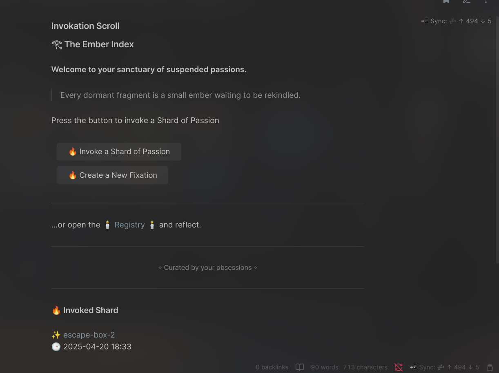

The Ember Index is a gentle system for tracking and revisiting your suspended fixations — creative projects, intellectual obsessions, half-finished builds, forgotten puzzles, abandoned sparks.

## Structure

Each fixation lives in its own note.  

Once added to the system, it can be "evoked" randomly through a ritual command or a click of a button.

Creating a fixation can be done by clicking a button too.

When you summon a fragment:

- A random fixation is selected
    
- Its link appears inside your Ember Index note
    
- A timestamp is added to mark the moment of return
    
- The event is logged in a ritual register for future reflection
    

You can revisit the ember, reignite it, or gently return it to sleep — without guilt, without pressure.

It's not a todo list.  
It's a memory temple for the parts of you that once burned brightly.

---

## ⚙️ Prerequisites & Setup

To make The Ember Index fully functional, you'll need two community plugins:

### 1. [Templater](https://github.com/SilentVoid13/Templater)

Used to execute the logic behind each ritual (random selection, timestamping, logging, file editing).

- Install **Templater** from the Community Plugins section
    
- Go to `Settings → Templater → Template folder location`  
    → Set your desired folder (e.g. `Templates/`; this is the suggested default for plug-and-play with this repository)
    
    **NOTE**: If you chose another folder, please change the `Templates` references in the step below with your configured folder
    
- Make sure "Trigger Templater on file creation" is **off** (optional but recommended)
    
- Go to `Settings → Templater → Template Hotkeys` and add a reference to `Templates/invokefixation.md`  
    (you don't need to assign a hotkey — just register the path; adjust it if you use a custom template folder)
       
- Do the same for `Templates/Fixation_base.md`  
    (you don't need to assign a hotkey — just register the path; adjust it if you use a custom template folder)

**IMPORTANT**: Make sure to copy `invokefixation.md` and  `Fixation_base.md` from this repository's `Templates` folder into your configured Templater folder.

---

### 2. [Buttons](https://github.com/shabegom/obsidian-buttons)

Used to add clickable buttons for summoning fragments inside your notes.

- Install **Buttons** from Community Plugins
    
- No setup required — just make sure your notes are in **Reading Mode** to see and use buttons properly
    

---

### 🧪 First-time Setup Steps

1. **Copy the folder `The Ember Index` from this repository into your Obsidian vault**
    
2. Inside it, populate the `fixations/` folder with your personal suspended projects (see format below)
    
3. Each fixation should be a single `.md` file (e.g. `escape-box.md`) inside the `fixations/` folder
    

**IMPORTANT**: If you are not using the default `Templates/` folder for Templater, be sure to update the `Invoke Scroll` buttons code accordingly to match your custom path.

---

## Usage

Once configured, just open the `Invokation Scroll` as any other note and use the buttons to interact with the system.